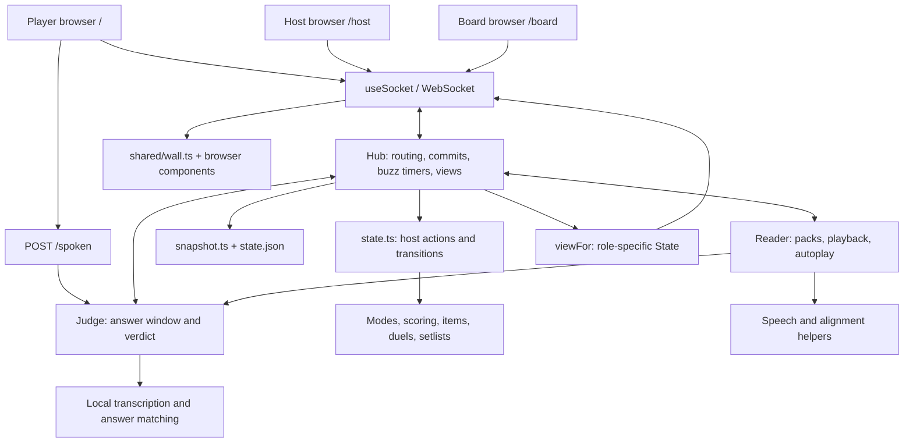
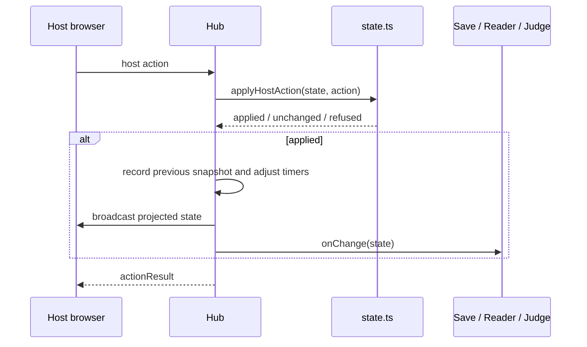
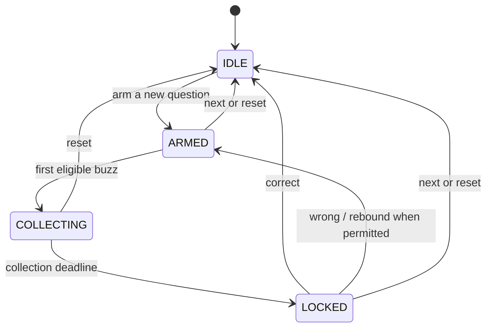

# Architecture

This document maps the current implementation of party-buzzer. It is a single
Node process serving three Preact browser surfaces on a trusted LAN. The server
owns gameplay; browsers send commands and derive presentation from role-specific
state. Local speech is optional. There is no database, remote game service,
authenticated host boundary, or dynamically loaded plugin system.

For operation, see [README.md](README.md). For working conventions, see
[AGENTS.md](AGENTS.md). Visual language and naming live in
[docs/design.md](docs/design.md). Historical plans may describe older wiring.

## Component map



Arrows show calls and data flow, not independent services. `Reader` and `Judge`
are objects in the same process as `Hub`. The composition root is
[server/index.ts](server/index.ts).

| Area | Owner | Responsibility |
| --- | --- | --- |
| Startup and transport | `server/index.ts` | Load state, construct services, HTTP(S), WebSocket, spoken uploads, shutdown flush |
| Room coordination | `server/hub.ts` | Connections, dispatch, undo history, collection timers, role views, change notification |
| Game transitions | `server/state.ts` | Apply host actions, distinguish outcomes, coordinate rule modules, load/save state |
| Buzz ranking | `server/resolve.ts` | Clamp and sort timestamps, deduplicate players, exclude lockouts |
| Gameplay framework | `server/items.ts`, `duel.ts`, `setlist.ts`, `eligibility.ts` | Inventories/effects, seating, block progression, effect and mode eligibility |
| Mode rules | `server/modes/` | Static registry, options, mode memory, scoring hooks and host status |
| Persistence projections | `server/snapshot.ts` | Separate undo data from durable disk data; restore invariants |
| Playback | `server/reader.ts`, `speech.ts`, `align.ts` | Pack preparation, cancellation, playback, reveal boundaries and autoplay |
| Spoken judging | `server/judge.ts`, `stt.ts`, `match.ts` | Attempt-scoped answers, local transcription, matching and verdict |
| Shared contracts | `shared/protocol.ts`, `legality.ts`, `scoring.ts`, `modes/types.ts` | Messages, state types, host legality and reusable rule primitives |
| Shared presentation | `shared/wall.ts` | Pure semantic moments and wall/phone projections |
| Browser runtime | `client/useSocket.ts`, `useReveal.ts`, `sound.ts` | Connection/clock lifecycle, reveal timing and browser audio |
| Browser surfaces | `client/Host.tsx`, `Player.tsx`, `Board.tsx` | Role-specific controls and rendering |
| Local instruments | `tools/`, `client/anim/`, `vite.config.ts` | Simulations, trace analysis, visual/audio workbench |

## Startup and change propagation

`startServer()` loads `state.json`, constructs the Hub and fresh catalogs,
selects available transcription/alignment capabilities, constructs the Judge
and Reader, and attaches the Reader to the Hub. It installs a change callback
that runs, in order:

1. Queue the durable state save.
2. Notify the Reader, including stopping speech when play leaves `ARMED` and
   waking its state waiters.
3. Notify the Judge so its answer window follows the current attempt/leader.

For each `Hub.changed(cause)`, tracing runs first, then state broadcasts, then
that callback. These are synchronous calls; observers can cause further
publications. This is explicit wiring, not an event bus or transactional
observer system. A transcript publication and its subsequent verdict can be
separate frames.

The HTTP server serves the built SPA at `/`, `/host`, and `/board`, assets from
`dist/`, the join QR at `/qr.svg`, and WebSocket upgrades at `/ws`.
`POST /spoken?player=<id>` accepts an answer recording, or text for test tools.
The Judge decides whether the player currently has a valid answer window.

`server/cert.ts` handles cached local-ip.sh certificates; `server/net.ts`
selects a LAN address and builds join information. The domain requires DNS on
joining devices. A raw HTTPS IP address does not match the wildcard certificate.
Closing the server disconnects sockets, closes HTTP connections, and flushes
pending saves.

## Commands, commits, and runtime publications



`Hub.dispatch` is the commit entry for host actions, including actions initiated
by the Reader and Judge. `applyHostAction` checks shared legality and validates
mode/rule identifiers, applies a transition, and detects an actual state change.
Refused and unchanged actions do not spend history, cancel timers, or broadcast.
The host receives an explicit result; setlist file loading can also report a
failed result. Undo has its own restoration path inside dispatch.

Not every message is a host action. The `act` route also handles player items,
duel participation, reader controls, file operations, module operations, and
runtime publications such as fragments, revealed answers, and judge windows.
Those paths do not automatically inherit dispatch acknowledgments or undo.
Reader/Judge runtime publications use in-process connection objects, not an
extra network socket.

`Hub.fragmentEnded(questionId, completed)` is a dedicated playback-to-mode
boundary. It rejects stale questions and non-armed phases, calls the current
mode hook, and publishes only if that hook changed state. It is not an undo
step. Keep this distinction when adding a new operation: a deliberate game
command, transient runtime fact, and playback event have different lifetimes.

## Round lifecycle and identity



This diagram summarizes the main paths; `shared/legality.ts` and mode rules
remain authoritative for whether a particular action is allowed. Autoplay can
hold a wrong verdict in `LOCKED` before a delayed rebound.

| Identity or timing | Meaning |
| --- | --- |
| `questionId` | Fresh on arm; stable across rebounds of the same question |
| `attemptId` | Fresh on arm, rebound, and active-question undo restoration |
| `armedAt` | Scheduled opening time, normally 300 ms after arming |
| Collection timers | Hub-owned provisional reveal at 150 ms and lock at 1000 ms after first buzz |
| Reader session/cancellation | Controls pending preparation, playback and dwell work |
| Judge attempt/leader key | Rejects answers or transcription results belonging to an old opportunity |

Press resolution clamps client time to `[armedAt, arrivedAt]`, takes the
earliest press per player, and sorts with deterministic tie-breaking. This is
jitter accommodation for trusted clients. Lockouts use shared player/team
score keys; effects and mode eligibility are checked through `eligibility.ts`.

Effects assigned to an attempt follow its identity. Do not use equal timestamps,
a repeated player, or the number of displayed fragments to infer that async
work still belongs to the current question. Reader callbacks check question
identity and cancellation; Judge work checks attempt, leader, and primed answers.

## State, role views, and presentation

The authoritative `State` includes gameplay plus selected runtime facts and
catalogs. It is not sent unchanged to every role and is not saved wholesale.

`Hub.viewFor` projects each broadcast:

- Host and board receive the full buzz order and reader progress. Only the host
  receives computed `game.status` from the current mode's `hostStatus` hook.
- Phones receive only their own order entries, plus the total buzz count.
  Reader progress and `round.whole` are always omitted.
- Phones receive revealed fragments and the revealed answer only when text
  mirroring is enabled. Mode memory is hidden by default; `viewModuleState`
  can explicitly project it.
- `readingActive` is public so all surfaces can select the same semantic moment
  without needing private playback progress.

The whole question **can be present in State** for board layout before it is
spoken. Phone redaction prevents reading ahead. Unrevealed accepted answers
remain private in Reader/Judge memory; the display answer enters State when
revealed. Keep those separate when adding content or projections.

`shared/wall.ts` chooses a semantic moment from public gameplay facts plus local
presentation inputs (`open`, `settled`, `retired`). Its 13 moments belong to five
families. Wall and phone projections use this shared decision; the wall selects
one middle occupant, such as a clue or hero. Browser effects supply clock and
animation progress. Equal inputs yield equal moments, but individual browsers
can be at different local animation stages.

`client/main.tsx` chooses a surface by pathname. Each surface uses `useSocket`
for its own connection. That hook handles reconnection, stored player identity,
clock-offset sampling, and scheduled opening. Host controls use shared legality;
phone behavior uses the redacted view and phone projection rather than applying
full-state host rules.

## Modes and composable rules

`shared/modes/types.ts` defines `GameModule<Options, Memory>`. A mode gets a
restricted context of players, teams, grouping, scores, round, and its own game
options/memory. Its option schema is checked against its typed option fields.
The heterogeneous registry and wire format necessarily erase some of those
concrete types; options are sanitized at the registry/state boundary.

`server/modes/index.ts` registers trivia and quizbowl statically. Optional hooks
cover arming, buzz eligibility, scoring, completed fragments, host acts, status,
viewer memory, and item grants. Trivia uses framework defaults. Quizbowl owns
power cutoff, neg/bounceback rules, and optional item grants.

The Reader reports completed fragments for both joined and fragment playback.
Quizbowl interprets that event to end power; it returns semantic status such as
“Power open” for the host to render. The Reader and host UI do not interpret
quizbowl options. The older `powerEnds` host act remains a compatible path.

Modules declare item grants as data. `items.ts` validates recipients and executes
named or random grants. `shared/scoring.ts` owns score-key selection, score
increments, and lockout helpers. Neither feature needs an import back into the
state transition coordinator.

Duels own entry/voting, seating, and who may participate. Setlists own block
configuration and progression, delegating settings changes through state
transitions. Saved pack/setlist catalogs are handled by `packs.ts` and
`setlists.ts`. These are framework capabilities shared across modes.

A mode switch is allowed while idle; choosing a different mode normally resets
scores unless the transition requests preservation. Updating options on the
same mode keeps scores and existing memory until its lifecycle hook resets it.
This is a bounded game-mode interface, not a general-purpose plugin lifecycle.

## Reading and judging

The Reader owns question packs and in-memory per-pack positions. Selecting a
pack starts queued speech preparation, with cached clips and bounded rendering
concurrency. Preparation can continue in the background, but each question waits
for its required audio before the Reader arms it. Setlist packs can be queued
ahead of their blocks.

With alignment available, the Reader plays a joined question and uses located
fragment/clause boundaries for progressive reveal and resume. Without alignment
capability, it uses fragment clips. A failed alignment of a joined clip can
produce coarse end-of-clip reveal. Speech uses `say` and media inspection, with
a compiled Swift seeking player when available and `afplay` as fallback.
Without native speech commands, playback degrades to silent text progression.

Buzzing interrupts speech. Autoplay waits for verdict, applies the configured
dwell, then rebounds or advances. Seeking can resume at the interrupted clause;
a joined clip without seeking support can restart from its beginning. Reader
cancellation prevents stopped/replaced sessions from driving later questions.

The Reader primes the Judge with private accepted answers. The Judge offers an
answer window for the current locked leader, accepts a submission, transcribes
when necessary, matches it, and sends the verdict through `Hub.dispatch`.
Submitted-attempt tracking prevents reentrant state publications from opening
another submission for the same opportunity. Late results after re-prime,
rebound, undo, or another question are discarded.

Question voice comes from the server machine. Browser cue audio is a separate
system: `cues.ts` defines recipes, `sound.ts` schedules them and reads scoped
tunables, and `synth.ts` supplies synthesis primitives. Browser microphone
recording is handled by `Talk.tsx`, `recorder.ts`, and `wav.ts`.

## Undo versus restart

| Data | Undo snapshot | Disk snapshot |
| --- | --- | --- |
| Players, teams, scores, settings, inventories | Yes | Yes |
| Connection flags and catalogs | Preserve live values | Rebuilt; players start disconnected |
| Current round/question and mode memory | Yes, with restore rules | No; retain round value and mode configuration |
| Playback state and judge window | No | No |
| Setlist position | Yes | Yes |
| Reader per-pack cursor | No | No |
| Attempt-bound effects | Restored and restamped | Excluded; unassigned effects can persist |

`gameSnapshot` and `restoreGame` define undo. Hub retains at most 20 snapshots
for applied actions. Restore preserves new arrivals and their scores, removes
fields absent from the snapshot, and leaves current catalogs/connections intact.
Undo stops reading and unprimes judging. A restored collection or held verdict
reopens; a settled leader can remain locked for manual judging. A fresh attempt
identity invalidates old work. Audio and pack position are not rewound.

`persistedSnapshot` defines version 1 disk data. `state.ts` queues writes per
path with a short debounce and flushes them on close. This is a whole-file
snapshot, not a journal or database. Loading supports the prior unversioned
shape, initializes mode memory, and resets the round. Unknown versions or
unreadable data fall back to a new state with diagnostics. Snapshot support is
not a universal migration for all historical field or directory renames.

## Development and validation

Native TypeScript runs directly under the pinned Node version. Vite builds the
browser application into `dist/`; the server does not build or watch it.

For HMR, the current proxy requires a plain HTTP backend at 8080. From the repo
root, this starts one without certificate or transcription-helper setup:

```sh
node --input-type=module <<'JS'
import { startServer } from './server/index.ts'
const server = await startServer({ tls: false, transcribe: null })
console.log(server.url)
process.on('SIGINT', () => {
  void server.close().then(() => process.exit(0))
})
JS
```

Run `npm run dev` in another terminal. This uses the normal saved room unless
you supply another `statePath`. Vite proxies `/ws` and `/qr.svg`, but not
`/spoken`; use the built HTTPS app for microphone flows.

`npm run motion` opens the standalone workbench. Its scenarios mount real
components, and its save endpoint edits marked CSS tunables and cue recipes.
The sound-library endpoints inspect local raw audio and adopt processed clips
using a locally installed `ffmpeg`, writing assets and credits. Those development
endpoints and `anim.html` do not ship in the production build.

| Validation area | Where to look |
| --- | --- |
| Actions, legality, history, persistence | `server/actions.test.ts`, `server/snapshot.test.ts`, `shared/legality.test.ts` |
| Ranking and WebSocket behavior | `server/resolve.test.ts`, `server/hub.test.ts`, `server/integration.test.ts` |
| Reader cancellation, timing and reveal | `server/reader.test.ts`, `server/reader.joined.test.ts` |
| Judging and stale answers | `server/judge.test.ts` |
| Mode boundaries and composed rules | `server/modes/*.test.ts`, `server/game-modes.integration.test.ts`, duel/setlist integration tests |
| Presentation and scoring | `shared/wall.test.ts`, `shared/scoring.test.ts`, `client/*.test.ts` |
| Tooling and audio asset processing | `tools/*.test.ts` |
| Physical phones, microphones and room audio | `docs/manual-checklist.md` |

`server/e2e.ts` provides real WebSocket clients and isolated server fixtures.
Logic tests inject speech/transcription/alignment capabilities. `npm test`
collects all five test locations; `npm run typecheck` and `npm run build` cover
compilation and bundling. Native speech capability and real devices still need
appropriate platform validation.

`TRACE=1` records Hub changes to `trace.jsonl`; `tools/trace.ts` inspects them and
`tools/rules.ts` checks trace invariants. Simulation, probes, fakes, and walkthroughs
are active clients: they change whichever room they connect to.

## Where a feature change belongs

- **New host command:** protocol and shared legality, state transition, dispatch
  outcome/history tests, then host control and result presentation.
- **New mode rule:** typed mode options/memory and hooks, registry entry if a new
  mode, generic status/schema rendering, and composed gameplay tests.
- **New player ability:** item/duel ownership and eligibility, role-checked act
  handling, phone control, and effects/lockout tests.
- **New state field:** choose live ownership, role visibility, undo and disk
  lifetimes explicitly; test restoration and redaction where affected.
- **New display behavior:** semantic moment/projection when it changes meaning;
  browser components and workbench scenarios when it changes presentation.
- **New asynchronous operation:** choose question or attempt scope, cancellation,
  stale-result checks, and behavior under stop, rebound, undo, and restart.

Keep these paths explicit. The existing boundaries support adding features
without requiring another coordination framework or separate mode-specific UI.
